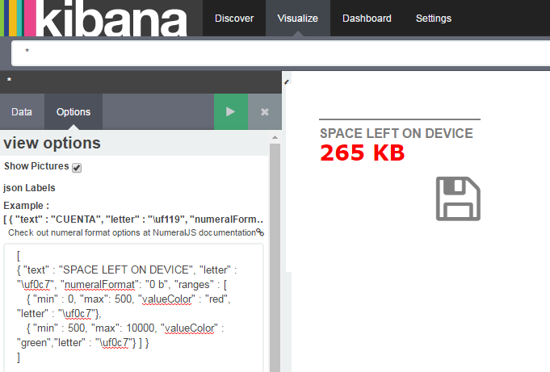

# Kibana BoxPlot Visualization Plugin

This is a BoxPlot diagram visType for Kibana, version 4.4.1.

This plugin is based on the exceptional D3 library,
by @mbostock [D3 Gallery](https://github.com/mbostock/d3/wiki/Gallery) (Thanks!).

And also on this [sample code](http://bl.ocks.org/z-m-k/5014368).

If you really liked this and feel like making a donation : <a href="https://www.paypal.com/cgi-bin/webscr?cmd=_donations&business=juan.carniglia@gmail.com&lc=AR&item_name=JuanCarniglia&item_number=1004&currency_code=USD&bn=PP-DonationsBF:btn_donate_LG.gif:NonHosted">

</a>



##Installation Steps

(Theses are optional, you can just copy the kbn_boxplot_violin_vis folder into
KIBANA_HOME/src/plugins) and run kibana.

```
git clone https://github.com/JuanCarniglia/kbn_boxplot_violin_vis.git 
cd kbn_boxplot_violin_vis
npm install
npm run build
cp -R build/kbn_boxplot_violin_vis/ KIBANA_HOME/installedPlugins
```

##How does it work

In order to work this plugins needs a simple Schema configuration:

- One Count Parameters
- Two levels of aggregattion (these will separate each dataset for each boxplot).

Also, there are some options:

- Show Violin
- Show BoxPlot
- Show Percentage
- Show Value
- Line Color
- Box Color
- Box Width (10 - 200 px)
- Y Axis Line Color
- Y Axis Text Color
- Y Axis Infer Domain (This will use ALL data to infer lower and upper limits for the domain)
- Y Axis Lower Bound Domain
- Y Axis Upper Bound Domain

